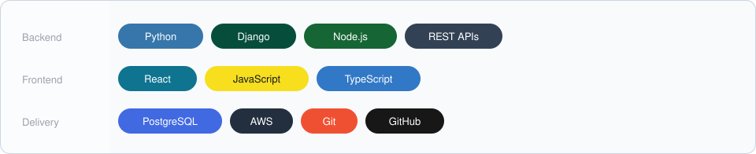

<!--
  Profile README for prodevgitstore-cool/prodevgitstore-cool.

  EDIT_CURRENT_FOCUS
    Rewrite the Current focus bullets so they match work you want to highlight.

  Header and technology artwork:
    profile/hero-light.svg
    profile/hero-dark.svg
    profile/tech-light.svg
    profile/tech-dark.svg
-->

<picture>
  <source media="(prefers-color-scheme: dark)" srcset="./profile/hero-dark.svg?v=3" />
  <source media="(prefers-color-scheme: light)" srcset="./profile/hero-light.svg?v=3" />
  
</picture>

## Summary

I build production web applications, backend services, and REST APIs. Python and Django are my main tools, with full-stack work in React, JavaScript, TypeScript, HTML, and CSS. I also use Node.js, and PostgreSQL for application data.

I work in existing codebases: tracing production issues, fixing bugs, and implementing changes while keeping live applications stable. Git, GitHub, and AWS cover version control and cloud work.

## Technology

<picture>
  <source media="(prefers-color-scheme: dark)" srcset="./profile/tech-dark.svg" />
  <source media="(prefers-color-scheme: light)" srcset="./profile/tech-light.svg" />
  
</picture>

## GitHub statistics

The first card is activity and repository totals. The second card is languages detected in public repositories. Both are generated from this GitHub account.

<table>
<tr>
<td align="center" width="50%">
<picture>
  <source media="(prefers-color-scheme: dark)" srcset="./profile/stats-dark.svg?v=2" />
  <source media="(prefers-color-scheme: light)" srcset="./profile/stats-light.svg?v=2" />
  
</picture>
</td>
<td align="center" width="50%">
<picture>
  <source media="(prefers-color-scheme: dark)" srcset="./profile/top-langs-dark.svg?v=2" />
  <source media="(prefers-color-scheme: light)" srcset="./profile/top-langs-light.svg?v=2" />
  
</picture>
</td>
</tr>
</table>

## Contribution graph

A 3D view of the last year of GitHub contributions. The light graph is an animated calendar and the dark graph uses the night-green view.

<picture>
  <source media="(prefers-color-scheme: dark)" srcset="./profile-3d-contrib/profile-night-green.svg?v=2" />
  <source media="(prefers-color-scheme: light)" srcset="./profile-3d-contrib/profile-green-animate.svg?v=2" />
  
</picture>

<!--
  Other graphs created by the same workflow, after the first successful run:
  ./profile-3d-contrib/profile-gitblock.svg
  ./profile-3d-contrib/profile-season-animate.svg
  ./profile-3d-contrib/profile-night-view.svg
  ./profile-3d-contrib/profile-night-rainbow.svg
  Swap the src and srcset above if you prefer one of those.
-->

## Current focus

<!-- EDIT_CURRENT_FOCUS: rewrite these bullets. Keep only work you want to highlight. -->

- Production web applications with Python and Django
- REST APIs and backend systems
- Full-stack work with React, JavaScript, and TypeScript
- Debugging, bug fixing, and production support

## Contact

<a href="https://github.com/prodevgitstore-cool">github.com/prodevgitstore-cool</a>

